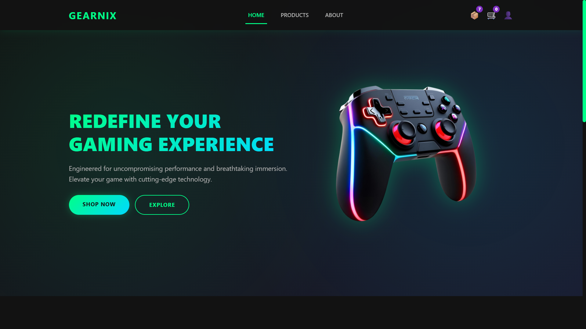
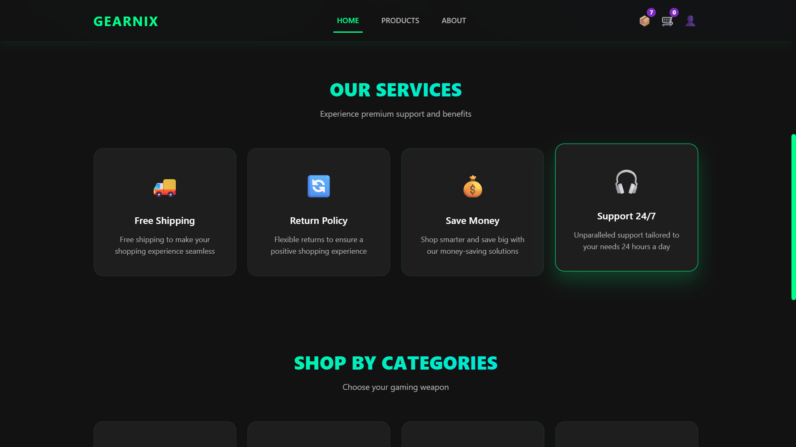
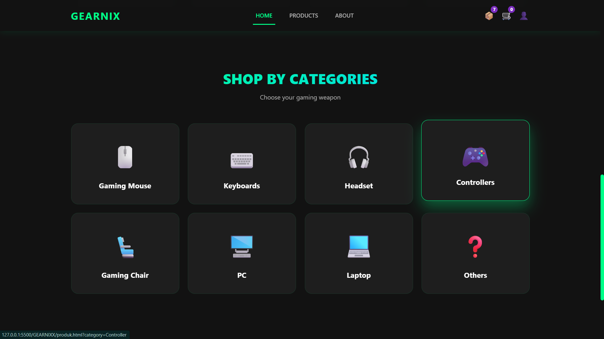
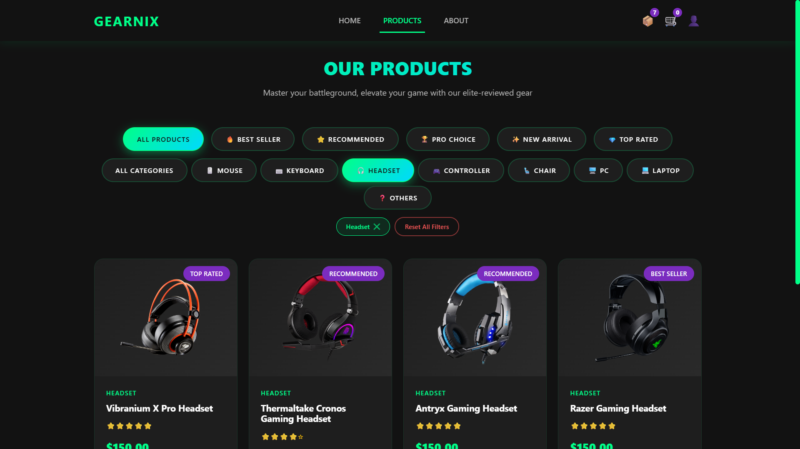
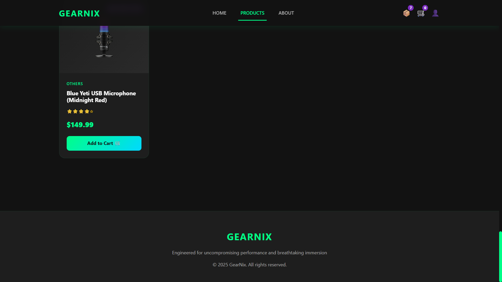
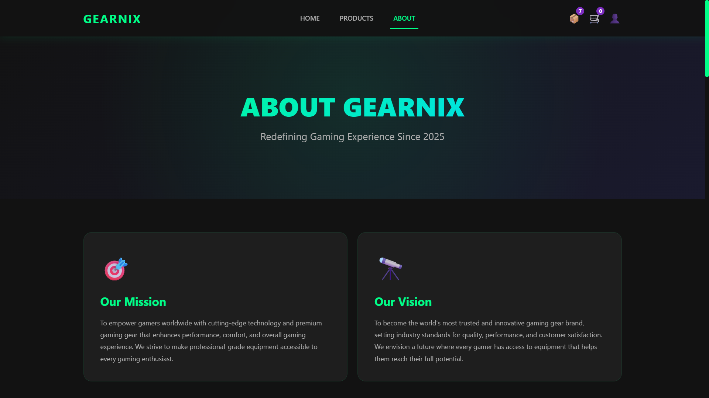
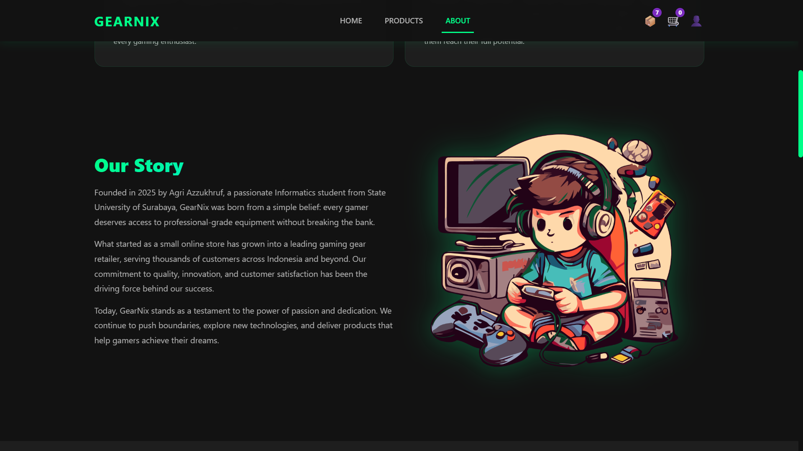
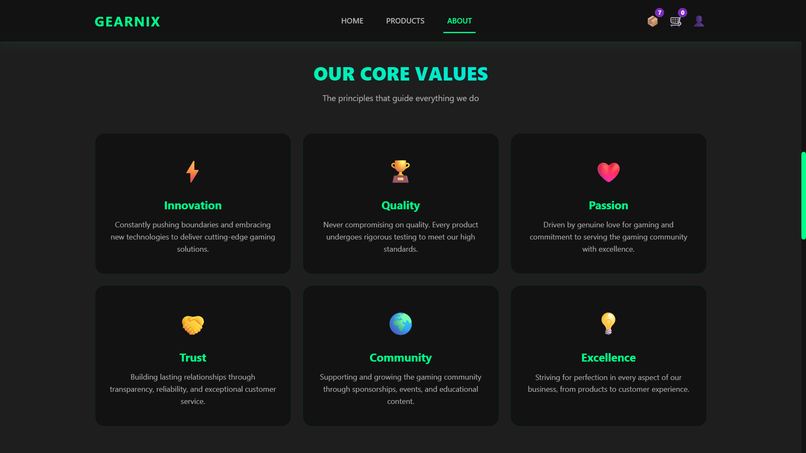
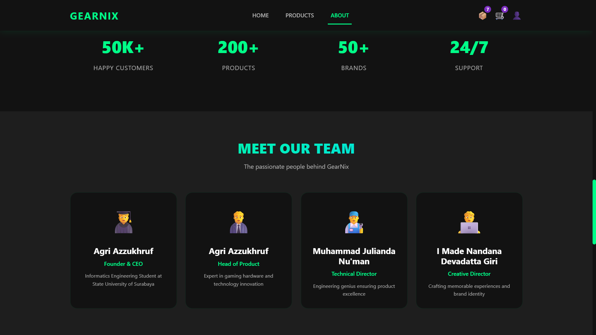
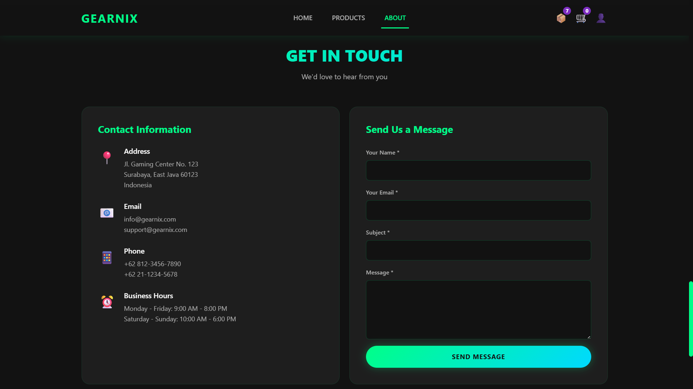

# ⚡ GearNix — Premium Gaming Gear Store

**GearNix** is a modern, visually striking e-commerce website for high-performance gaming equipment.  
Built with **HTML**, **CSS**, and **JavaScript**, it offers an immersive shopping experience featuring dynamic product displays, interactive filters, and responsive design.

---

## 🌟 Overview

GearNix allows gamers to explore and purchase top-tier gaming products — from **mice**, **keyboards**, and **headsets** to **controllers** and **PC accessories**.  
Users can filter items by category or tag (e.g., *Best Seller*, *Recommended*, *New Arrival*), view detailed product specs, and manage their cart and checkout process seamlessly.

---

## 💻 Core Features

- 🛍️ **Dynamic Product Listing** – Filter by category or tag with instant rendering.  
- 🧾 **Product Detail Modal** – View images, specs, price, and warranty info in a sleek pop-up.  
- 🛒 **Interactive Shopping Cart** – Add, remove, or adjust quantities in real time.  
- 👤 **User Profile System** – Save and update personal information for checkout convenience.  
- 📦 **Order History** – Track all previous orders easily.  
- 🎨 **Modern Neon UI** – Dark mode aesthetic with glowing neon highlights.

---

## 🧠 Tech Stack

- **Frontend:** HTML5, CSS3, JavaScript (Vanilla JS)
- **Frameworks/Libraries:** Bootstrap 5, AOS (Animate on Scroll)
- **Design Theme:** Neon Dark Mode

---

## 🚀 Pages

- **Home:** Introduction, services, and category navigation.  
- **Products:** Filtered catalog with product details and add-to-cart features.  
- **About:** Company mission, vision, story, and team presentation.

---

## 📂 Project Structure
```
GearNix/
│
├── index.html / home.html      # Halaman utama
├── produk.html                 # Halaman katalog produk
├── about.html                  # Halaman tentang kami
│
├── style.css                   # Styling utama
├── script.js                   # JavaScript utama
├── cart.js                     # Logika shopping cart
├── profile.js                  # Manajemen profile
├── data.js                     # Data produk & service
│
└── image/                      # Folder gambar produk
    ├── mouseGaming.png
    ├── keyboardGaming.png
    ├── headsetGaming.png
    ├── controllerGaming.png
    ├── gamingChair.png
    ├── pcGaming.png
    ├── laptopGaming.png
    └── ... (dan gambar lainnya)
```

## Screenshots
|  |  |  |  |
|------------------------------------------|------------------------------------------|------------------------------------------|------------------------------------------|
|   |  |  |  |
|  |  |  |  |